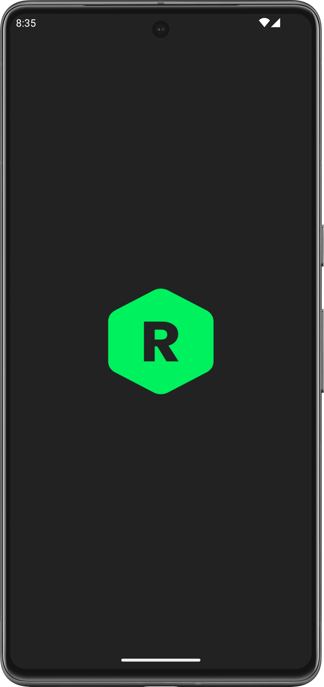
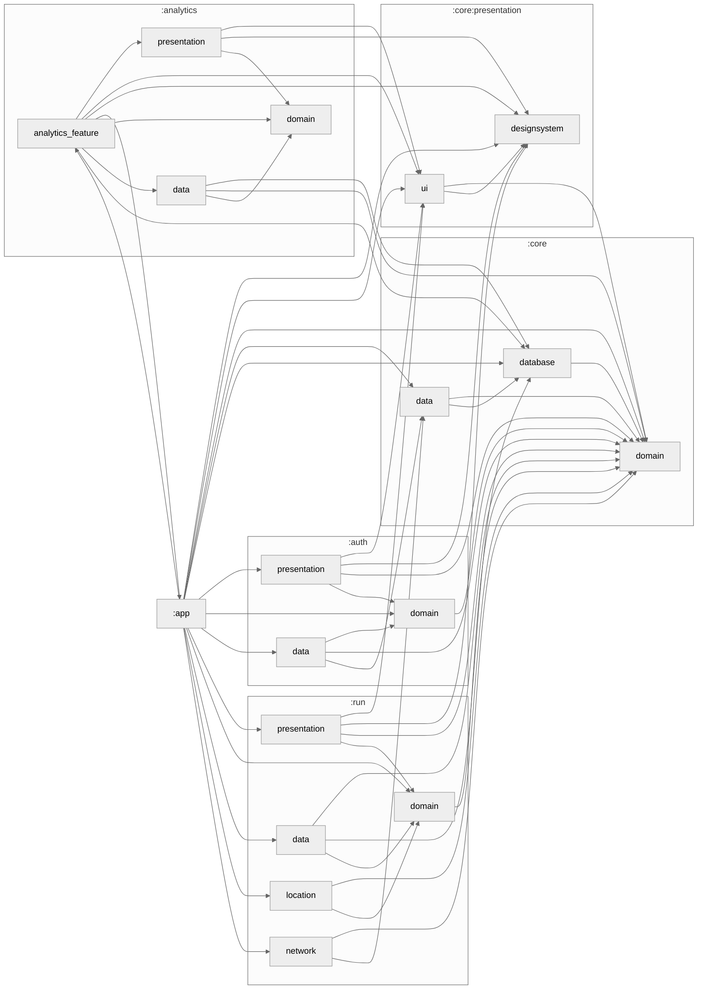

# Welcome to RunAway app!

Hi! I'm your first Markdown file in **StackEdit**. If you want to learn about StackEdit, 
you can read me. If you want to play with Markdown, you can edit me. 
Once you have finished with me, you can create new files by opening the **file explorer** 
on the left corner of the navigation bar.

|  |Image2|Image3|Image4|
|----------------------------------------------|-|-|-|
| Image5                                       |Image6|Image7|Image8|

# Build with

StackEdit stores your files in your browser, which means all your files are automatically saved 
locally and are accessible **offline!**

# Module Graph

## Analytics module

You can open a file from **Google Drive**, **Dropbox** or **GitHub** by opening the **Synchronize** 
sub-menu and clicking **Open from**. Once opened in the workspace, any modification in the file will 
be automatically synced.

# Setup for personal use

Publishing in StackEdit makes it simple for you to publish online your files. Once you're happy 
with a file, you can publish it to different hosting platforms like **Blogger**, **Dropbox**, 
**Gist**, **GitHub**, **Google Drive**, **WordPress** and **Zendesk**. 
With [Handlebars templates](http://handlebarsjs.com/), you have full control over what you export.
