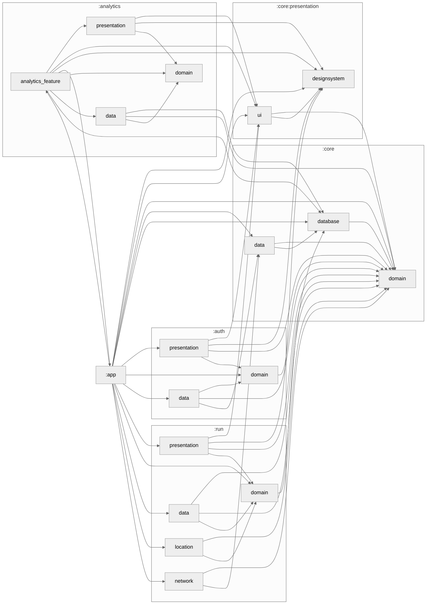

### Module Graph

```mermaid
%%{
  init: {
    'theme': 'neutral'
  }
}%%

graph LR
  subgraph :analytics
    :analytics:presentation["presentation"]
    :analytics:domain["domain"]
    :analytics:analytics_feature["analytics_feature"]
    :analytics:data["data"]
  end
  subgraph :auth
    :auth:domain["domain"]
    :auth:data["data"]
    :auth:presentation["presentation"]
  end
  subgraph :core
    :core:domain["domain"]
    :core:database["database"]
    :core:data["data"]
  end
  subgraph :core:presentation
    :core:presentation:ui["ui"]
    :core:presentation:designsystem["designsystem"]
  end
  subgraph :run
    :run:domain["domain"]
    :run:data["data"]
    :run:network["network"]
    :run:presentation["presentation"]
    :run:location["location"]
  end
  :run:domain --> :core:domain
  :run:data --> :core:domain
  :run:data --> :core:database
  :run:data --> :run:domain
  :core:database --> :core:domain
  :auth:domain --> :core:domain
  :analytics:presentation --> :core:presentation:ui
  :analytics:presentation --> :core:presentation:designsystem
  :analytics:presentation --> :analytics:domain
  :run:network --> :core:domain
  :run:network --> :core:data
  :core:presentation:ui --> :core:domain
  :core:presentation:ui --> :core:presentation:designsystem
  :auth:data --> :auth:domain
  :auth:data --> :core:domain
  :auth:data --> :core:data
  :app --> :analytics:analytics_feature
  :app --> :core:presentation:designsystem
  :app --> :core:presentation:ui
  :app --> :core:domain
  :app --> :core:data
  :app --> :core:database
  :app --> :auth:presentation
  :app --> :auth:domain
  :app --> :auth:data
  :app --> :run:presentation
  :app --> :run:domain
  :app --> :run:data
  :app --> :run:location
  :app --> :run:network
  :auth:presentation --> :core:presentation:ui
  :auth:presentation --> :core:presentation:designsystem
  :auth:presentation --> :core:domain
  :auth:presentation --> :auth:domain
  :run:location --> :core:domain
  :run:location --> :run:domain
  :core:data --> :core:domain
  :core:data --> :core:database
  :analytics:data --> :core:database
  :analytics:data --> :core:domain
  :analytics:data --> :analytics:domain
  :analytics:analytics_feature --> :analytics:presentation
  :analytics:analytics_feature --> :core:presentation:ui
  :analytics:analytics_feature --> :core:presentation:designsystem
  :analytics:analytics_feature --> :app
  :analytics:analytics_feature --> :analytics:domain
  :analytics:analytics_feature --> :analytics:data
  :analytics:analytics_feature --> :core:database
  :run:presentation --> :core:presentation:ui
  :run:presentation --> :core:presentation:designsystem
  :run:presentation --> :core:domain
  :run:presentation --> :run:domain
```
# RunAway