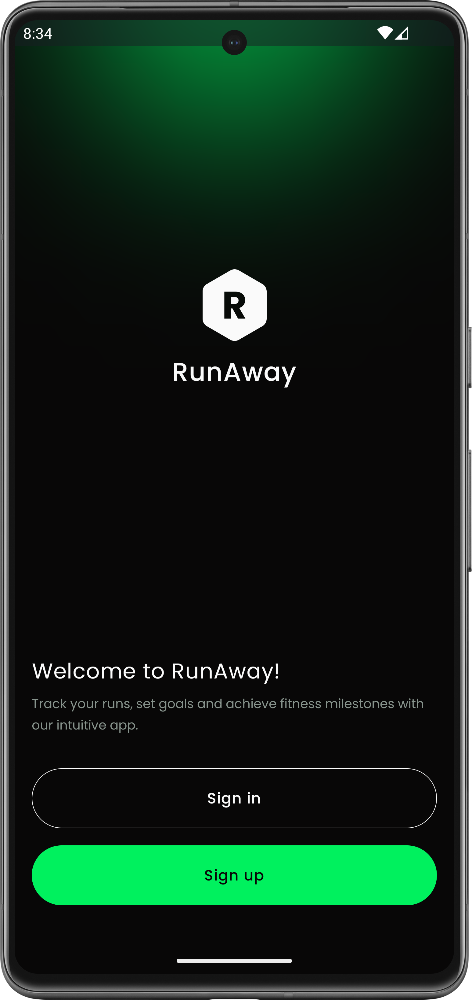
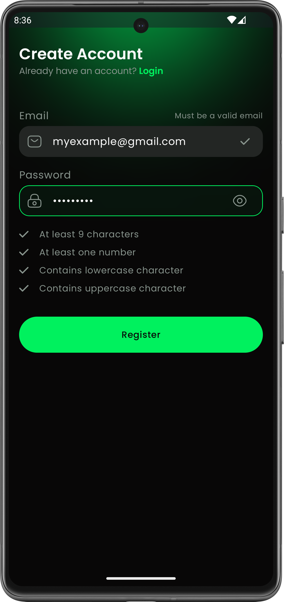
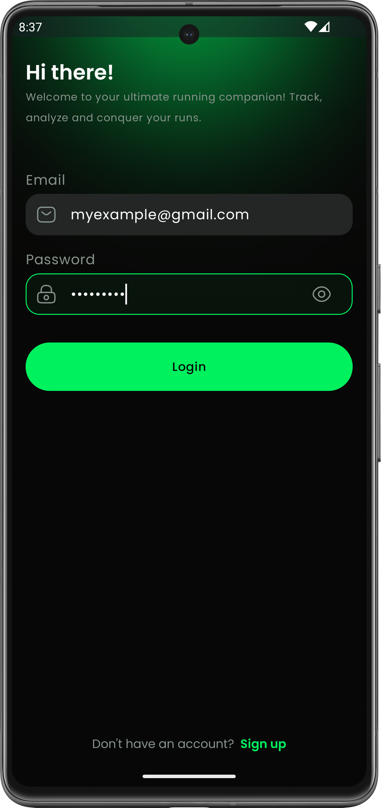
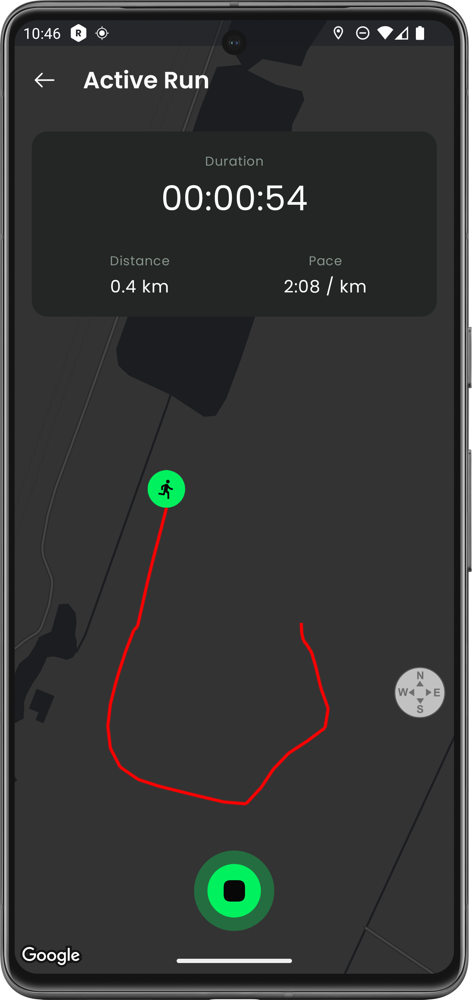
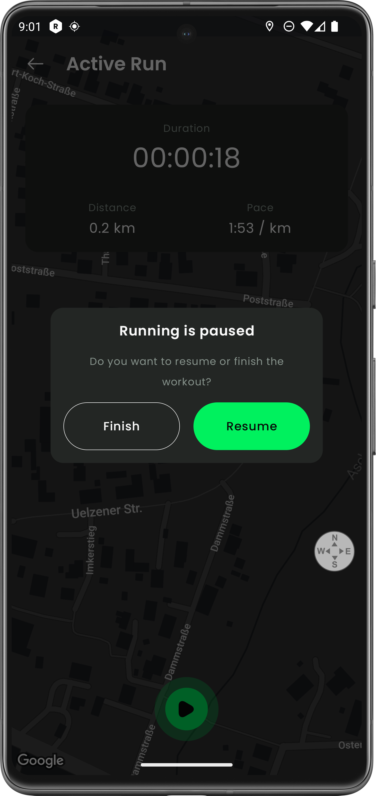
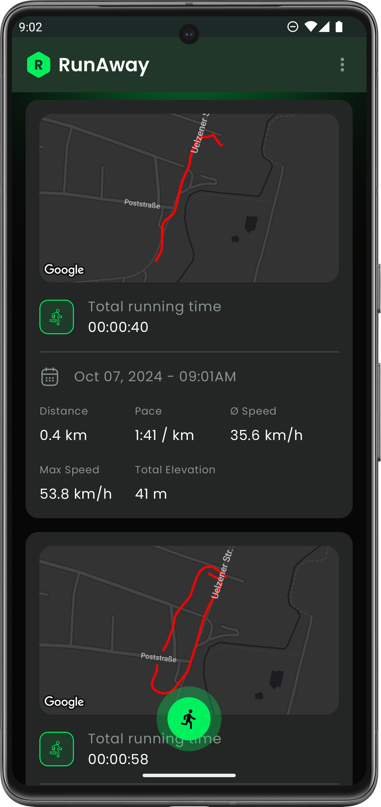
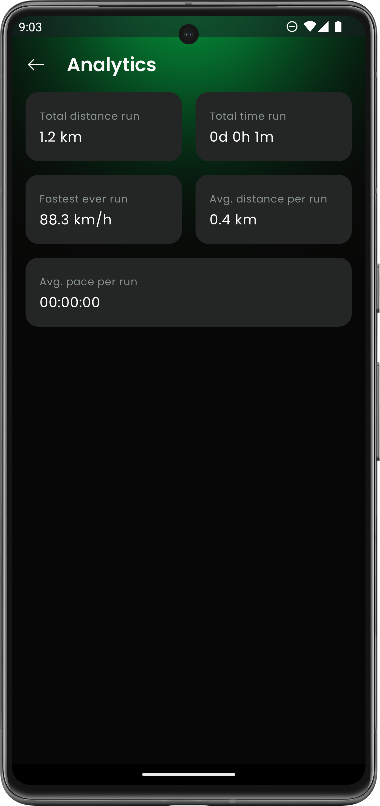
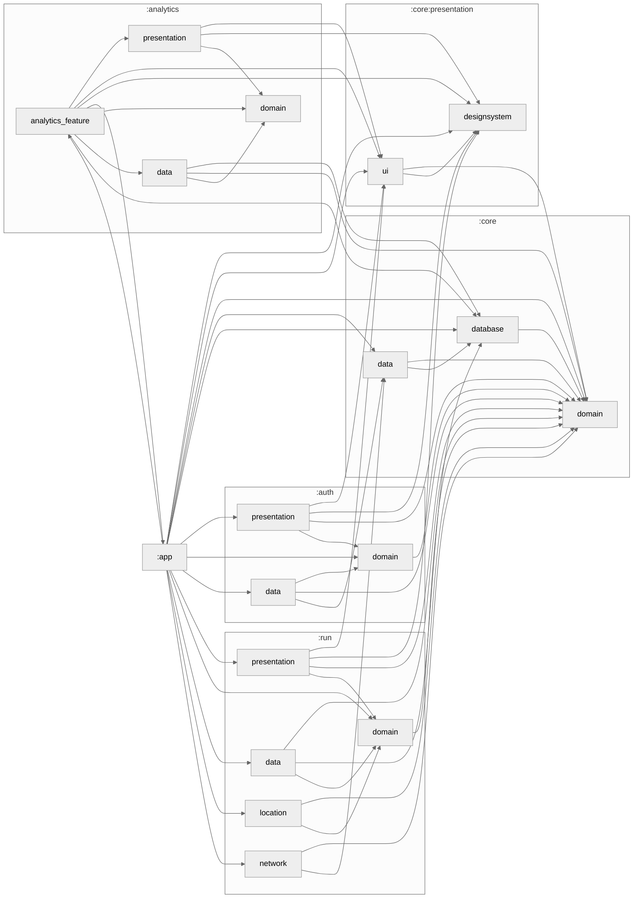

# Welcome to RunAway app!

Hi! I'm your first Markdown file in **StackEdit**. If you want to learn about StackEdit, 
you can read me. If you want to play with Markdown, you can edit me. 
Once you have finished with me, you can create new files by opening the **file explorer** 
on the left corner of the navigation bar.

|  |  |  |  |
|----------------------------------------------|----------------------------------------------|----------------------------------------------|----------------------------------------------|
|  |  |  |  | 

# Build with

| Technology                                                                                     | Description                                                                                       | Version |
|------------------------------------------------------------------------------------------------|---------------------------------------------------------------------------------------------------|---------|
|  | **Jetpack Compose** - Modern toolkit for building native Android UIs using declarative components | Bom 2024.02.02  |
|  | **Kotlin Coroutines** - Asynchronous programming framework for managing background tasks          | 1.8.0   |
|  | **Flow** - Kotlin's reactive streams API for handling data streams and asynchronous operations    | 1.8.0   |
|  | **Jetpack Room** - Persistence library for local storage using SQLite                             | 2.6.1   |
|  | **Navigation Compose** - Navigation library for managing UI navigation in Compose apps            | 2.7.7   |
|  | **Koin** - Lightweight dependency injection framework for Kotlin                                  | 3.5.3   |
|  | **Ktor** - Framework for building asynchronous servers and clients in Kotlin                      | 2.3.8   |

> These technologies were selected to ensure efficient, scalable, and modern Android app development.

# Module Graph

## Analytics module

You can open a file from **Google Drive**, **Dropbox** or **GitHub** by opening the **Synchronize** 
sub-menu and clicking **Open from**. Once opened in the workspace, any modification in the file will 
be automatically synced.

# Setup for personal use

Publishing in StackEdit makes it simple for you to publish online your files. Once you're happy 
with a file, you can publish it to different hosting platforms like **Blogger**, **Dropbox**, 
**Gist**, **GitHub**, **Google Drive**, **WordPress** and **Zendesk**. 
With [Handlebars templates](http://handlebarsjs.com/), you have full control over what you export.

